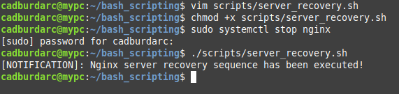
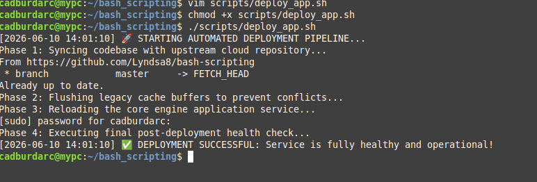
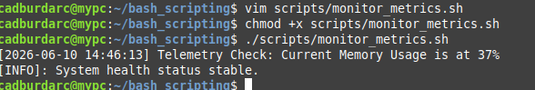
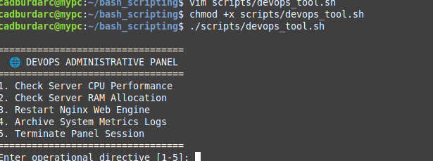
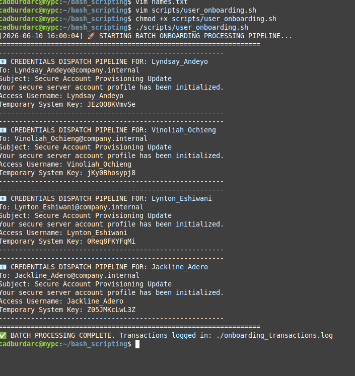

# 🚀 Week 3 — Systems Automation & DevOps Scripting Lab

## 1. Production Server Recovery Engine (Lab 1)

### 📋 Scenario
Nginx crashes at midnight. Create automation that:
* Detects failure
* Restarts nginx
* Logs issue
* Sends notification

### 💻 Terminal Success Verification

## 2. DevOps Deployment Script (Lab 2)

### 📋 Scenario
A software development team pushes a new feature update to GitHub. Instead of manually updating the application server, a single automated deployment pipeline must be executed to refresh the server safely. The system must:
* Pull the latest codebase updates directly from GitHub.
* Clear out legacy data buffers and temporary cache files.
* Restart the underlying core web application service.
* Perform a post-deployment health check to verify system stability.

### ⚙️ How the Automation Works (Step-by-Step)

1. **Upstream Code Synchronization:** The pipeline initiates by contacting the remote repository repository on GitHub. It automatically scans for new modifications and synchronizes the local application folder with the cloud infrastructure.
2. **Cache Isolation & Cleansing:** To eliminate conflicts between old data variables and the fresh update, the system forcefully purges the contents of the temporary runtime storage directory.
3. **Core Engine Restart:** The pipeline communicates directly with the Linux operating system's process manager to drop the active system memory state of the Nginx web server and trigger a graceful restart, instantly loading the new deployment.
4. **Service Health Telemetry Verification:** Finally, the script queries the live runtime status of the application. If the server responds with a healthy execution signal, a success confirmation is generated. If an unexpected crash occurs, the pipeline raises an emergency stop flag to alert the engineering team.

### 💻 Terminal Success Verification

# 📊 Lab 3 — AWS EC2 Metric Monitor

> A lightweight infrastructure monitoring tool deployed directly on an AWS EC2 instance, designed to provide continuous visibility over cloud-based virtual machines and prevent unexpected downtime.

---
## Project Objective
An infrastructure operations team needs to maintain continuous visibility over their cloud-based virtual machines without forcing engineers to monitor server statistics around the clock. This automation agent is designed to:

- Extract real-time resource telemetry metrics including memory usage and capacity constraints
- Evaluate active resource metrics against defined infrastructure safety limits
- Automatically flag performance anomalies and generate system alerts under peak loads
- Maintain a persistent history log to preserve an audit trail for future capacity planning

---

## Architectural Workflow

### 1. Telemetry Metric Extraction

The automated monitoring script interfaces directly with the underlying Linux OS kernel to pull live hardware utilization performance numbers, calculating precise memory allocation statistics.

### 2. Threshold Evaluation Loop

The script acts as an internal logic gate, instantly running the extracted performance data against a hardcoded system threshold (e.g., **80% utilization capacity limit**) to analyze infrastructure strain.

### 3. Dynamic Alerting System

If real-time resource usage breaches the preconfigured safety limit, the pipeline immediately triggers an elevated warning flag in the console log to alert engineers that the server is running hot.

### 4. Persistent Log Archiving

To ensure compliance and support post-incident reviews, the tool appends a formatted entry containing a precise timestamp and metric values into a local monitoring log file during every evaluation cycle.

---

## Terminal Success Verification

# ⚙️ Challenge 1 — Menu-Driven Automation Tool

> A unified, interactive console for managing and monitoring a Linux server's core functions safely — consolidating structural operations into a secure, keyboard-driven dashboard so junior engineers don't need to memorize complex CLI parameters or dangerous system flags.

---

## Project Objective

A system administration team needs a unified, interactive console to manage and monitor a Linux server's core functions safely. The tool is designed to:

- Extract immediate hardware diagnostics for processing power and operational memory capacity
- Interface safely with the system process controller to reload network engine infrastructure
- Aggregate and archive system transaction records into compressed security backups
- Provide an elegant, continuous runtime loop that remains active until explicitly terminated

---

## Architectural Workflow

### 1. Persistent Execution Loop

The script initializes an endless conditional evaluation environment that ensures the control interface re-renders instantly after completing a task, keeping the engineer locked within the secure management dashboard.

### 2. Interactive Selection Handling

The system constructs an interactive textual interface on the screen, captures user keystroke inputs, and routes them through an optimized `case` block to trigger specific administrative routines.

### 3. Modular Function Isolation

Each diagnostic routine — from reading CPU statistics to executing service resets — is completely isolated into a self-contained function. This guarantees that a minor error inside the memory checking utility cannot crash the entire control application.

### 4. Graceful Pipeline Termination

When the operator chooses to close the dashboard, the system bypasses standard error exit channels, clears temporary runtime environment buffers cleanly, and returns the terminal console back to the standard command line safely.

---

## Terminal Success Verification

# 👥 Challenge 2 — Automated User Onboarding Engine

> An identity pipeline that onboards batches of new corporate employees onto an application server simultaneously — eliminating the need for systems engineers to manually invoke administration commands for every individual account.

---

## Project Objective

An enterprise security and HR department requires an efficient pipeline to onboard batches of new corporate employees onto an application server simultaneously. The orchestration script is designed to:

- Parse a plain-text database source file to extract standardized employee account usernames
- Communicate directly with the system security database to securely create local user profiles
- Programmatically compute complex, high-entropy alphanumeric password keys for every account
- Dispatch system network configurations to securely deliver access credentials to each employee

---

## Architectural Workflow

### 1. Structured Data Stream Reading

The tool establishes a file-reading loop that scans an external text registry row-by-row, stripping away trailing whitespace and isolating individual personnel identifiers.

### 2. Directory Object Creation

The script utilizes administrative authority to interface with the core Linux OS security framework, safely creating structural home directories and matching system groups for each employee.

### 3. High-Entropy Secret Generation

To maintain a strong defensive posture, the engine uses a cryptographic random character generator to compile unique, high-strength password strings on the fly for every single row parsed.

### 4. Credential Dispatch Logging

The tool feeds newly created parameters into a localized mail transport agent or simulation pipeline, capturing the transaction in a dedicated system migration log to verify successful credential handoff.

---

## Terminal Success Verification

